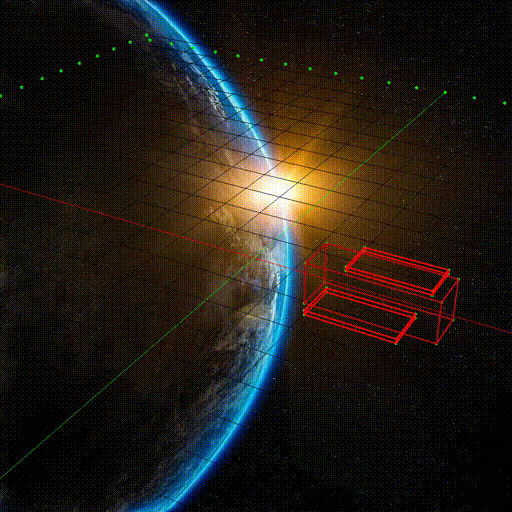

# OpenCV-3D-Renderer

Satellite rendering site, under development in order to simulate the view from a camara onboard.
This project is built in order to create a simulation environment of 3D object (i.e., satellite) floating in space.

Forked site from [`zainkhan-afk/OpenCV-3D-Renderer:main`](https://github.com/zainkhan-afk/OpenCV-3D-Renderer).
Some enhancements can be found in this fork such as hierarchial matrix rotation.
As it can bee seen here under, the panels of the satellite are moving along the satellite and rotating around a single axis in its local system of reference.

Project to be used as generation of simulated data to: [VerneDA](https://github.com/bryanitou/VerneDA)

  

Creator's in commit [8fa6dbe](https://github.com/zainkhan-afk/OpenCV-3D-Renderer/commit/8fa6dbe239068c36b028fc26b2491b49205abfc9):

This repository renders 3D shapes using OpenCV. A camera is simulated and its intrinsic and extrinsic matrices are defined. Similarly, 3D shapes such as cube, sphere and torus can also be defined in 3 dimensional space. The 3D coordinates of these shapes are projected onto a 2 dimensional plane using the camera matrices, these 2D points are then drawn to the screen.

  

